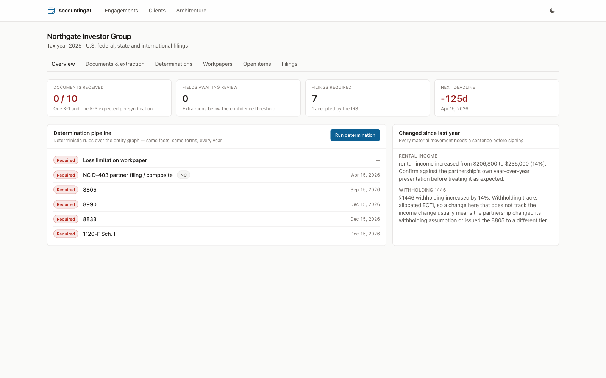
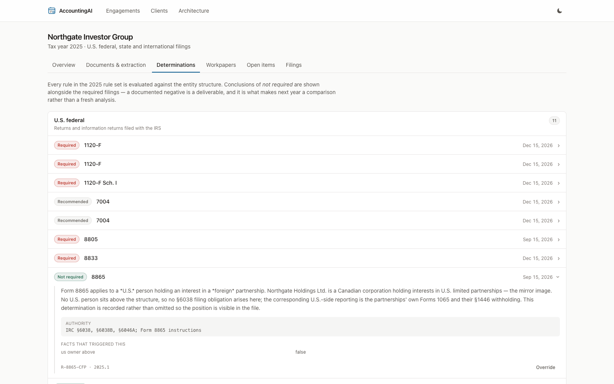
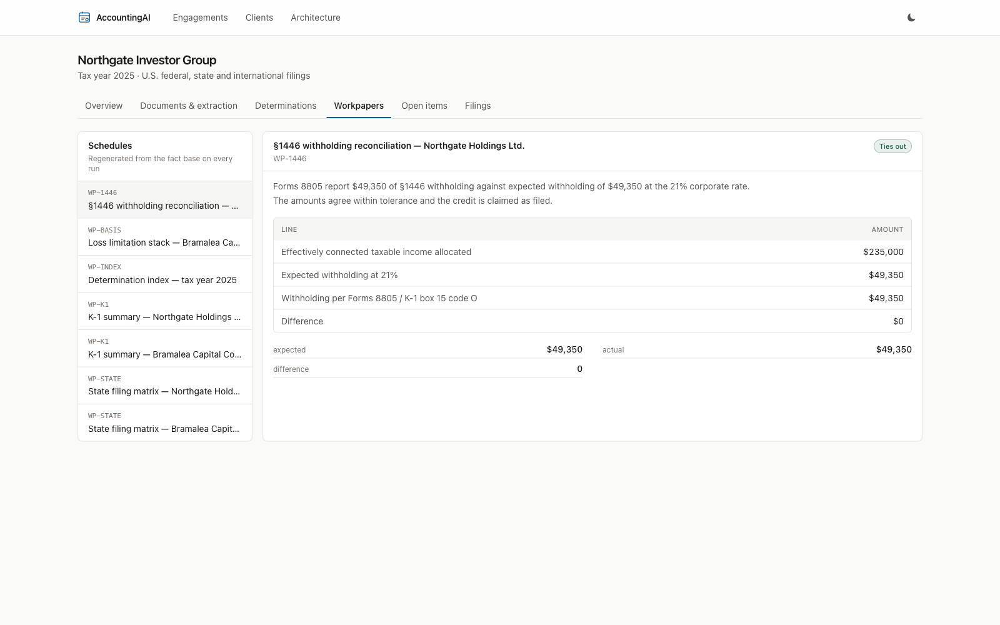
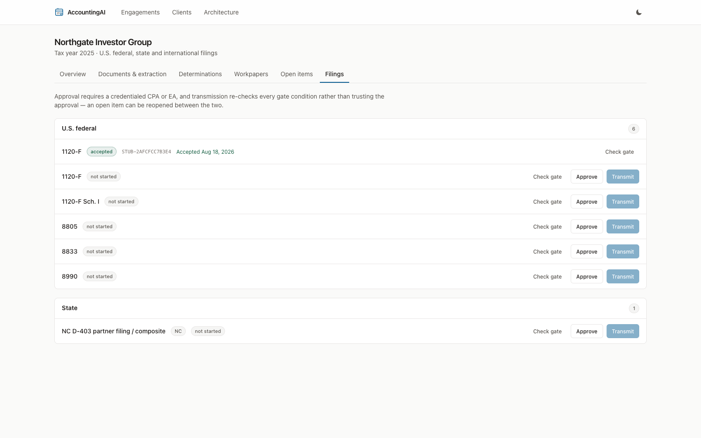
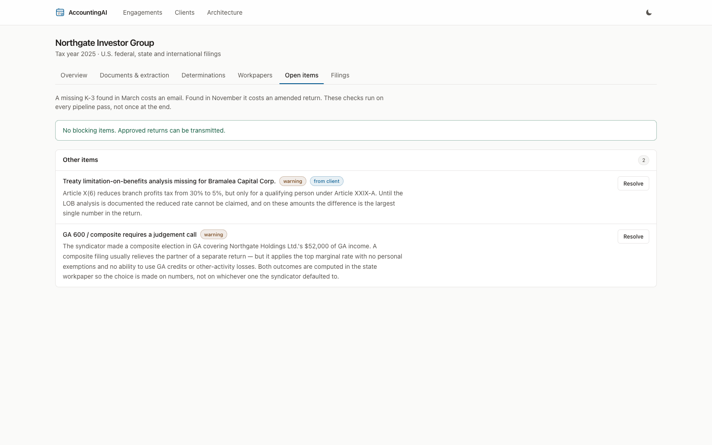
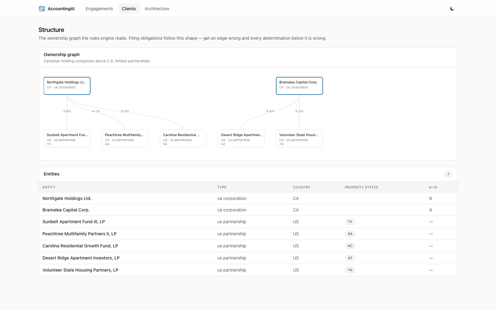
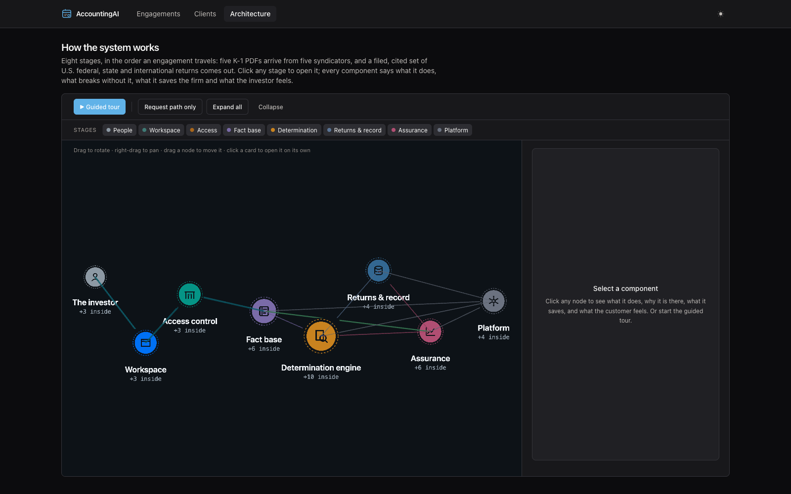
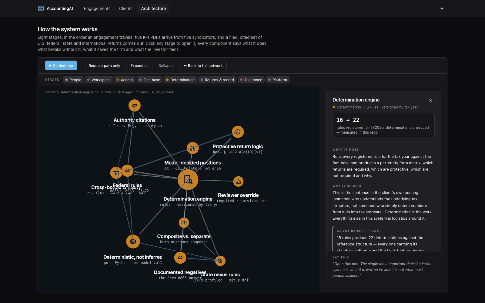
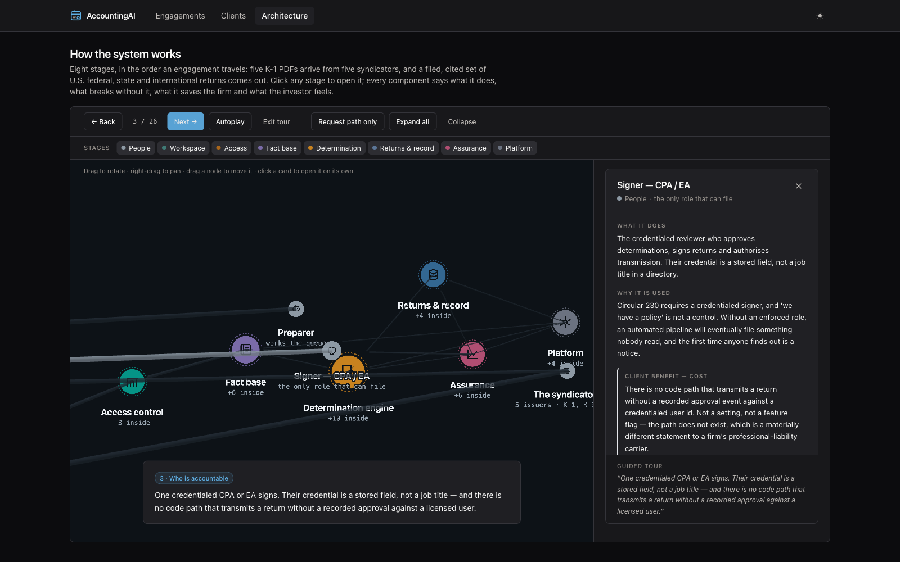

# AccountingAI

**U.S. tax compliance for non-U.S. investors in U.S. real-estate syndications.**

Built for a specific, recurring shape of engagement: a Canadian investor holding passive
LP interests in five U.S. multifamily syndications through two Canadian holding companies,
who needs the U.S. federal, state and international filings prepared and e-filed every
year — repeatably, defensibly, for a fixed fee.

The platform runs the whole engagement:

```
Intake → Extraction → Structure → Determination → Preparation → Review → File → Deliver
```

Six of those eight stages are automated. **Review** and **File** require a credentialed
CPA or EA, by design — there is no code path that transmits a return without a recorded
approval against a licensed user.

---

## What makes it more than a document reader

The client's own brief said it best: *"someone who understands the underlying tax
structure, not someone who simply enters numbers from K-1s into tax software."*

That is the determination engine. It answers questions no tax package asks:

- Does a Canadian corporation holding an LP interest in a partnership that owns U.S. real
  property have effectively connected income? (Yes — §875(1), §897(a).)
- With no ECI this year, is a **protective** Form 1120-F still needed? (Yes — without a
  timely return, §882(c)(2) denies *all* deductions and credits.)
- Does the 5% branch-profits treaty rate apply, or is the limitation-on-benefits analysis
  undocumented? (The engine refuses to claim it until it is documented.)
- Which of six states actually wants a return, and did the sponsor's composite election
  leave this partner better or worse off?
- Does **Form 8865** apply? (No — and the negative conclusion is recorded with its
  reasoning, because the client asked about it by name.)

Determination is deterministic Python, versioned by tax year, and every conclusion carries
its statutory authority. The model reads documents; it does not decide filing positions.
See [`docs/TAX_RULES.md`](docs/TAX_RULES.md).

---

## The application

### Engagement overview

Where an engagement stands in one screen: documents in against documents expected, the
review queue, filings required, and the closest deadline. The right-hand column is the
year-over-year tie-out — every material movement gets a sentence before anyone signs.



### Determinations, with the authority attached

Every rule in the tax year's rule set, evaluated against the entity structure. Conclusions
of *not required* sit alongside the required filings — a documented negative is a
deliverable, and it is what makes next year a comparison rather than a fresh analysis.

Expanded here: the **Form 8865** conclusion the client asked about by name, with its
reasoning, its citation (IRC §6038, §6038B, §6046A) and the facts that triggered it.



### Workpapers

Generated from the fact base on every run, never hand-keyed — which is why year two is
cheap. The §1446 reconciliation is the one that earns its keep: it ties each Form 8805 to
K-1 box 15 code O and checks the payee TIN is actually the filer's.



### Filings and the gate

Approval requires a credentialed CPA or EA. Transmission re-checks every gate condition
rather than trusting the approval, because an open item can be reopened in between.



### Open items

Missing information found before filing, not after. A missing K-3 found in March costs an
email; found in November it costs an amended return — which on a fixed fee is a re-run of
the whole engagement for nothing. Blocking items are wired to the filing gate.



### Structure

The ownership graph the rules engine reads: two Canadian holding companies above five U.S.
limited partnerships, with each partnership's property situs. Filing obligations follow
this shape — get an edge wrong and every determination below it is wrong.



---

## Architecture

`/architecture` in the running app is an interactive 3D pipeline with a 26-stop guided
tour. It is entirely static data and renders with the API stopped — a demo should never
fail because a service is cold. Written companion:
[`docs/ARCHITECTURE.md`](docs/ARCHITECTURE.md).

### Eight stages, in the order an engagement travels



### Click a stage and it opens on its own

The determination engine, isolated with its ten parts. Every component answers four
questions — what it does, what breaks without it, what it saves the firm, and what the
investor feels.



### A guided tour that carries the commercial argument

Twenty-six stops, following the pipeline in order and never doubling back. It includes the
stop about what was deliberately **not** built — letting a model pick the forms directly —
and why that would be the wrong trade.



---

## Repository

```
backend/     FastAPI · SQLAlchemy 2.0 · Postgres · arq · Alembic
  app/rules/       the determination engine — 16 rules, versioned by year
  app/services/    extraction, workpapers, completeness, tie-out, e-file, memo
  app/api/v1/      29 routes, all firm-scoped
  tests/           61 tests, offline
frontend/    Next.js 16 · React 19 · TypeScript · Tailwind
  app/architecture/   interactive 3D architecture explorer
  tests/              42 graph-integrity and tour-narrative tests
docs/        product scope, tax rules, architecture, screenshots
```

## Running it

```bash
make install      # backend + frontend dependencies
make up           # Postgres, Redis, MinIO
make migrate      # schema
make seed         # the reference engagement: 2 holdcos, 5 syndications, 2 tax years
make api          # http://localhost:8000  (docs at /docs)
make worker       # extraction worker
make web          # http://localhost:3000
```

Seeded login: `dana.reyes@crossbordertax.test` / `demo-password` (CPA, reviewer role).

Without an `AAI_ANTHROPIC_API_KEY` the extraction pipeline runs against a deterministic
stub, so the whole system works end to end offline.

## Tests

```bash
make test         # 103 tests: no network, no database, no API key
```

`StubExtractionClient` and `StubTransmitter` mean no test can reach a model API or the
IRS. Tests assert conclusions rather than code paths — that the 1120-F is due in the sixth
month, that the loss limitation stack runs in statutory order, that the filing gate
reports every blocker at once.

## Scope boundaries

Stated plainly, because scope creep in tax software is how you rebuild Lacerte badly:

- Not a full IRC calculation engine — it determines, assembles and ties out.
- Not Canadian domestic compliance — T1134, T1135 and FTC timing are flagged as advisory
  items for the client's Canadian accountant, not filed here.
- Not an IRS-authorized transmitter — it integrates with one through a documented adapter.
- Not unsupervised filing.
